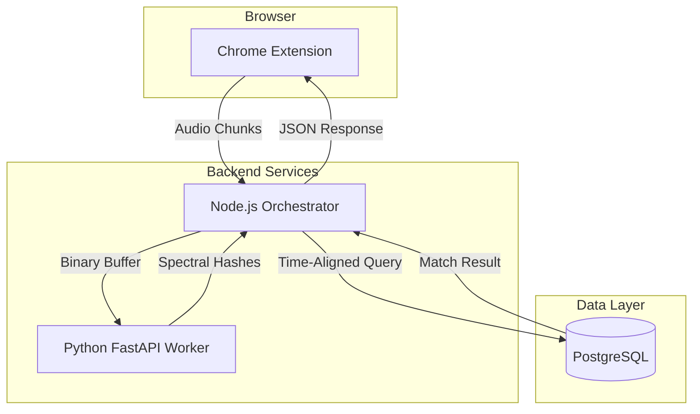

<div align="center">
  
  <h1>Echo: High-Resolution Audio Recognition</h1>
  <p><i>A professional, distributed system for real-time acoustic fingerprinting and identification.</i></p>

  [](https://opensource.org/licenses/MIT)
  [](https://bun.sh/)
  [](https://fastapi.tiangolo.com/)
  [](https://reactjs.org/)
</div>

---

**Echo** is a state-of-the-art audio identification system that recognizes music directly from browser tabs. It leverages a **distributed microservice architecture** and a **spectral-fingerprint matching algorithm** (inspired by Dejavu/Shazam) to ensure high accuracy and sub-second latency.

## 🚀 Key Features

-   **🎯 Real-time Tab Capture**: Directly intercept audio from any Chrome tab using high-fidelity capture APIs.
-   **🌌 Acoustic Fingerprinting**: Converts audio into a spectral "peak constellation" map, highly resistant to noise and compression.
-   **🏗️ Production-Grade Architecture**:
    -   **Distributed Processing**: Node.js server handles orchestration/DB, while a specialized Python FastAPI worker manages heavy signal processing.
    -   **Vectorized Math**: Uses NumPy and SciPy for high-speed FFT (Fast Fourier Transform) and peak detection.
    -   **Secure Synchronization**: Sync large fingerprint datasets from the generator to the database using JWT-authenticated webhooks.

## 🏗️ System Architecture



## ⚡ One-Minute Setup

To quickly spin up the environment with Docker:

1.  **Clone the Repository**:
    ```bash
    git clone https://github.com/lwshakib/echo-shazam-clone.git
    cd echo-shazam-clone
    ```

2.  **Start Infrastructure**:
    ```bash
    docker-compose up -d
    ```

## 🛠️ Monorepo Breakdown

Each component contains its own detailed implementation and setup instructions:

| Component | Technology | Description |
| :--- | :--- | :--- |
| [**/server**](server/README.md) | Bun, Express, PostgreSQL | Central orchestrator and metadata synchronization. |
| [**/fingerprint-generator**](fingerprint-generator/README.md) | Python, FastAPI, librosa | Specialized worker for spectral hashing (FFT). |
| [**/chrome_extension**](chrome_extension/README.md) | React, Vite, CRXJS | High-fidelity audio interception and identification UI. |

---

## 🧪 Quick Start Guide

### 1. Database Initialization
Ensure Docker is running and the database service is up:
```bash
docker-compose up -d
```

### 2. Configure Environment `.env`
Each service requires a `.env` file based on its `.env.example`. Refer to the component-level READMEs for specific variable documentation.

### 3. Populating the Library
Place audit tracks (`.mp3`, `.wav`) in the `/audios` directory and run the indexing batch mode:
```bash
cd fingerprint-generator
.\.venv\Scripts\activate
python main.py --batch
```

### 4. Identification Workflow
1.  Initialize the **Orchestrator** (`cd server && bun run dev`).
2.  Initialize the **Worker** (`cd fingerprint-generator && python main.py`).
3.  Load the **Chrome Extension** in your browser and click **Identify**.

## 🤝 Contributing
Contributions are welcome! Please read [CONTRIBUTING.md](CONTRIBUTING.md) for details on our workflow and coding standards.

## 📄 License
This project is licensed under the MIT License - see the [LICENSE](LICENSE) file for details.